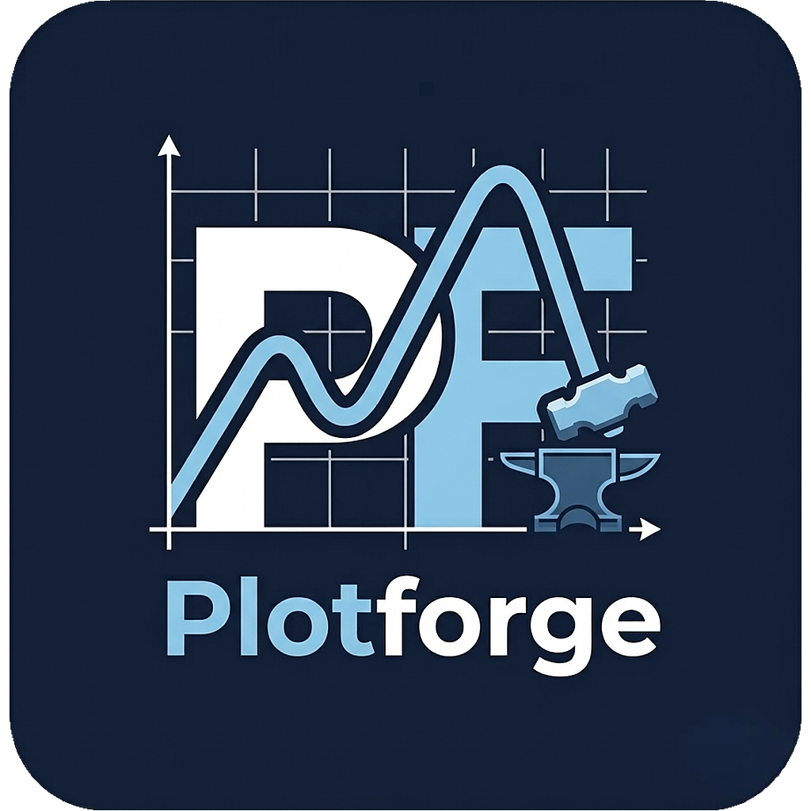
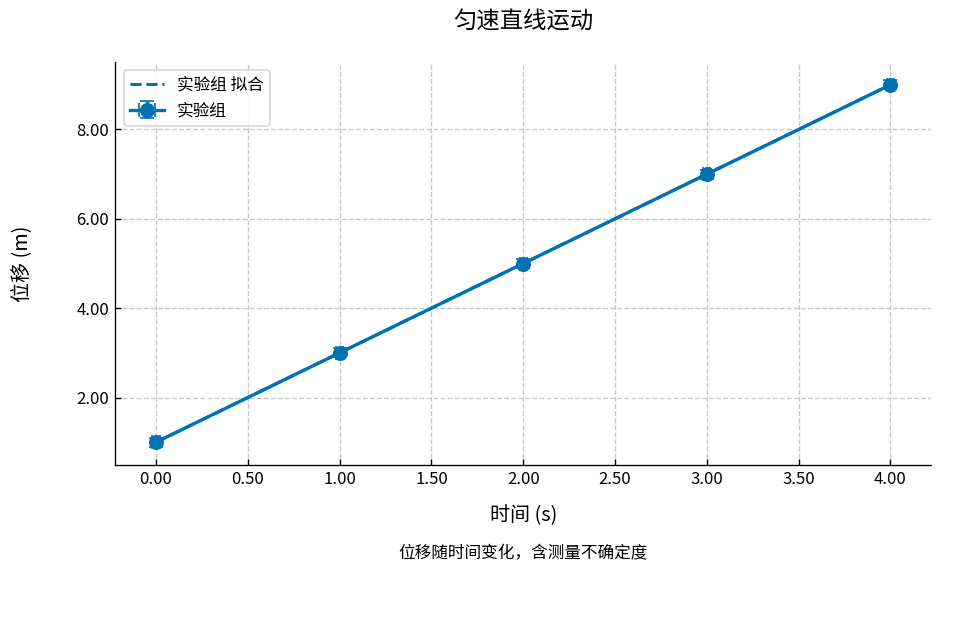
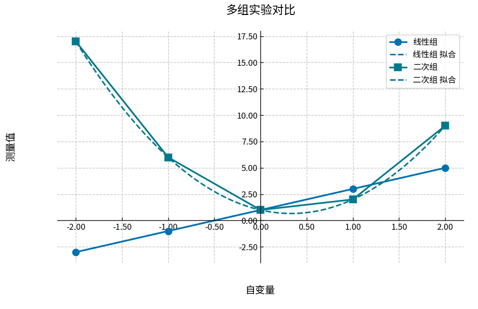
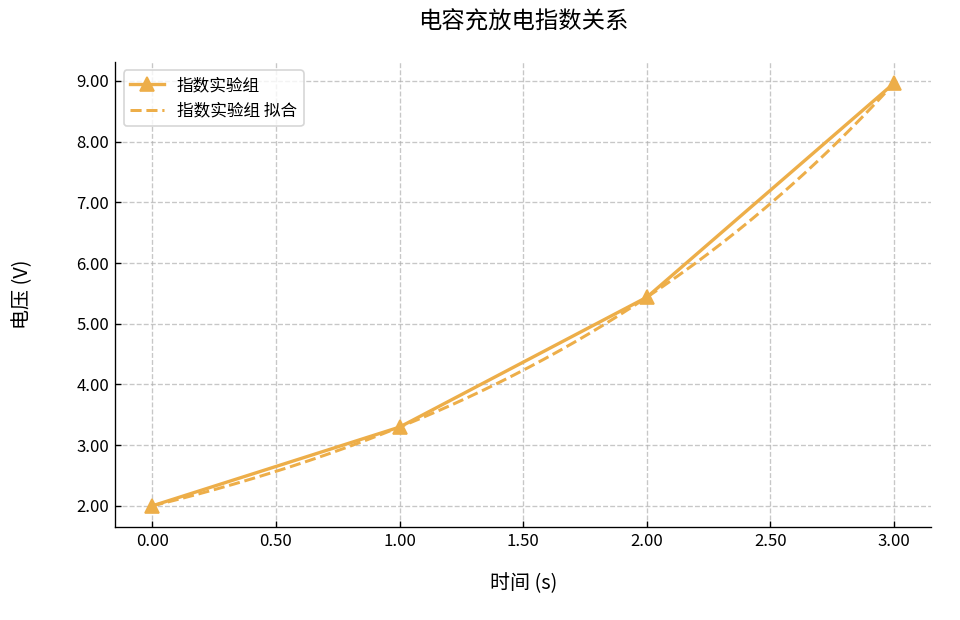
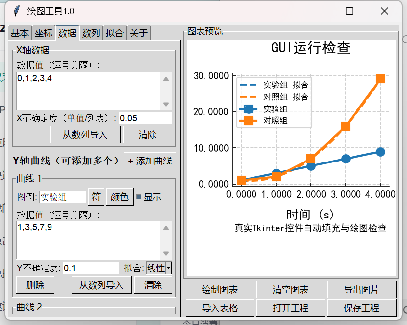
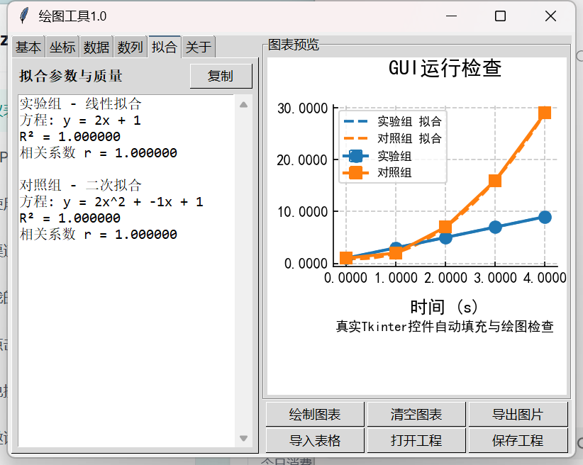

<p align="center">
  
</p>

<h1 align="center">Plotforge</h1>

<p align="center">面向物理实验的数据绘图、误差分析与曲线拟合工具</p>

[](https://github.com/ZivSpectra/Plotforge/actions/workflows/ci.yml)

Plotforge 是面向物理实验数据处理的跨平台曲线绘图应用。主界面使用 Flet，可运行于 Windows、Android 和 Linux；Tkinter 界面作为 Windows 兼容入口保留。数据校验、数列生成、误差棒、拟合、导入导出和工程文件由共享 Python 模块实现。

## 下载应用

预发布安装包位于 [GitHub Releases](https://github.com/ZivSpectra/Plotforge/releases/tag/v0.1.0-preview)：

- `Plotforge-Windows.zip`：Windows 10/11 免安装便携版，解压后运行 `Plotforge.exe`
- `Plotforge-Android-arm64.apk`：Android 64 位测试版，支持 Android 7.0（API 24）及以上系统
- `SHA256SUMS.txt`：安装包 SHA-256 校验值

当前 Release 是功能预览版。Android APK 有意使用 Flet 默认的调试签名，首次安装需要允许浏览器或文件管理器“安装未知应用”，不适合直接上架应用商店。不同构建的调试证书可能变化；如果手机提示签名冲突，需要先备份 `.pplot` 工程、卸载旧版，再安装新版。Windows 便携版尚未购买代码签名证书，系统可能显示未知发布者提示。

## 主要功能

- 多条 Y 曲线共享一组 X 数据，原始测量值不会被自动偏移或修改
- 等差、等比数列生成，可预览并写入 X 数据或任意 Y 曲线
- X/Y 不确定度与误差棒，支持统一数值或逐点列表
- 线性、二次和指数拟合
- 显示拟合方程、参数、R² 和相关系数
- 导入 CSV、XLSX、XLSM 实验数据
- 使用 `.pplot` 保存和恢复完整绘图工程
- 导出 PNG、JPG、SVG、PDF 图像
- 自定义标题、图表说明、坐标轴、单位、范围、精度、网格和图例
- 零点位于显示范围时，X、Y 坐标轴在数据原点 `(0,0)` 相交；零点位于范围外时保持边缘坐标轴
- 多组高辨识度曲线颜色和数据点样式
- 响应式手机/桌面布局与深色模式
- 拒绝 NaN、inf、非法坐标范围和不匹配的数据点数量
- 内置 Noto Sans SC 字体，保证跨平台中文显示

## 效果展示

以下图片由仓库中的真实绘图和 GUI 自动化测试生成，不是静态设计稿。

“多组实验”包含正负数据，可以看到两条坐标轴在 `(0,0)` 相交；其他仅含正值的数据图会保留边缘坐标轴，避免为了显示零点而压缩有效数据区域。

| 匀速直线运动：误差棒与线性拟合 | 多组实验：线性与二次拟合 |
| --- | --- |
|  |  |

| 电容充放电：指数拟合 | Windows 兼容界面：数据与图表 |
| --- | --- |
|  |  |



## 手机端数列生成

底部选择“数列”，然后依次设置：

1. 选择“等差数列”或“等比数列”。
2. 选择写入 `X 数据` 或某一条 `Y 曲线`。
3. 输入起始值、结束值以及步长或公比。
4. 点击“预览”检查结果，或点击“生成并写入”直接填充目标数据。

每次数列最多生成 1000 个点。步长为零、方向错误、无效公比、NaN、inf 和无法到达结束值的参数会被拒绝，不会卡死界面或提前分配巨大数组。

示例：

| 类型 | 起始值 | 结束值 | 步长/公比 | 结果 |
| --- | ---: | ---: | ---: | --- |
| 等差 | 0 | 2 | 0.5 | `0,0.5,1,1.5,2` |
| 等差 | 3 | -1 | -1 | `3,2,1,0,-1` |
| 等比 | 1 | 16 | 2 | `1,2,4,8,16` |
| 等比 | 16 | 1 | 0.5 | `16,8,4,2,1` |

## 数据格式

X 和 Y 数据使用英文逗号分隔：

```text
0,1,2,3,4
```

不确定度可以填写一个统一值：

```text
0.05
```

也可以填写与数据点数量一致的逐点数值：

```text
0.05,0.05,0.06,0.06,0.08
```

CSV 或 Excel 文件的第一行为列名，第一列作为 X，其余列分别导入为 Y 曲线：

| 时间 | 实验组 | 对照组 |
| ---: | ---: | ---: |
| 0 | 1 | 1 |
| 1 | 3 | 2 |
| 2 | 5 | 7 |

## 工程文件

`.pplot` 工程文件用于保存仍需继续编辑的实验绘图状态，包括：

- 原始 X/Y 数据和不确定度
- 曲线名称、颜色、数据点、可见状态和拟合方式
- 标题、图表说明、坐标轴名称和单位
- 坐标范围、精度、网格和图例设置

Windows、Android 和 Tkinter 兼容版使用同一种工程格式。工程文件用于继续编辑，导出的图片用于实验报告、打印或分享。

## 从源码运行

环境要求：Python 3.12 或更高版本。

Windows PowerShell：

```powershell
git clone https://github.com/ZivSpectra/Plotforge.git
cd Plotforge
python -m venv .venv
.\.venv\Scripts\Activate.ps1
python -m pip install -r requirements.txt
python main.py
```

Linux：

```bash
git clone https://github.com/ZivSpectra/Plotforge.git
cd Plotforge
python -m venv .venv
source .venv/bin/activate
python -m pip install -r requirements.txt
python main.py
```

运行 Tkinter 兼容版：

```powershell
python plotforge_tk.py
```

## 自动化测试

运行 34 项单元与回归测试：

```powershell
python run_tests.py
```

运行三组真实绘图测试：

```powershell
python cross_platform_smoke_test.py
```

三组测试覆盖：

1. 数列生成、线性运动数据及 X/Y 误差棒。
2. 两条曲线的线性和二次拟合。
3. 指数数据与指数拟合。

Windows 上还可以运行 Tkinter 真实窗口测试：

```powershell
python gui_smoke_test.py
```

GitHub Actions 会在每次 push 和 Pull Request 时，使用 Python 3.12 在 Windows 与 Ubuntu 上自动运行 34 项测试和三组真实绘图测试，并上传生成的图片。`Build preview packages` 工作流可由维护者手动触发，在 Ubuntu 上重复测试并构建调试签名的 Android APK；它不会自动创建 Release 或上传应用商店。

## 构建应用

构建 Windows 便携版：

```powershell
.\build_windows.ps1
```

构建 Android 64 位 APK：

```powershell
.\build_android.ps1
```

Android 构建还需要 Flutter、JDK 17 和 Android SDK。构建目标为 `arm64-v8a`，最低 API 24。Matplotlib 在 Android 上使用解压部署，相关配置已包含在 `pyproject.toml` 和构建脚本中。

预发布构建不会传入自定义 Android keystore，因此 APK 使用调试签名。`build_android.ps1` 会清除可能继承的 `FLET_ANDROID_SIGNING_*` 环境变量，防止本地预览包意外使用正式密钥。调试签名适合测试和侧载，不提供稳定升级链；未来准备上架应用商店时，需要另行创建并安全保管正式 keystore。

在 Windows 本地构建 APK 时，Flutter 插件需要系统允许创建符号链接，通常需要开启 Windows“开发者模式”。不希望修改系统设置时，可在 GitHub Actions 中手动运行 `Build preview packages` 工作流完成 Linux 构建。

本项目的发布文件整理到：

```text
dist/
├── Plotforge-Windows.zip
└── Plotforge-Android-arm64.apk
```

`build/` 和 `dist/` 不提交到 Git 仓库，正式成品通过 GitHub Release 附件提供。

## 项目结构

| 文件 | 作用 |
| --- | --- |
| `main.py` | Flet 跨平台应用入口 |
| `flet_app.py` | 手机与桌面响应式界面 |
| `app_state.py` | 表单状态、数列写入和绘图编排 |
| `plot_core.py` | 数据解析、数列计算、拟合与 Matplotlib 绘图 |
| `data_io.py` | CSV、Excel 数据导入 |
| `project_io.py` | `.pplot` 工程保存与恢复 |
| `plotforge_tk.py` | Tkinter 兼容入口 |
| `tests/` | 跨平台功能测试 |
| `test_regressions.py` | 历史缺陷回归测试 |
| `cross_platform_smoke_test.py` | 三组真实绘图测试 |
| `gui_smoke_test.py` | Windows Tkinter 窗口测试 |
| `.github/workflows/ci.yml` | Windows/Ubuntu 持续集成配置 |
| `build_windows.ps1` | Windows 便携版构建脚本 |
| `build_android.ps1` | Android APK 构建脚本 |

## 许可证与使用提示

仓库暂未声明开源许可证。在许可证补充之前，源代码默认保留全部权利。应用用于实验数据整理和绘图，重要实验结果仍应核对原始记录、单位、误差模型和拟合方法。
